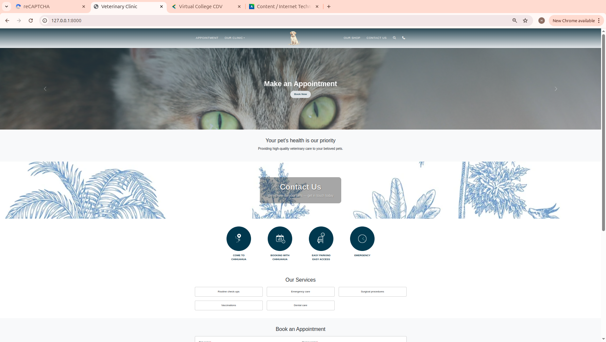
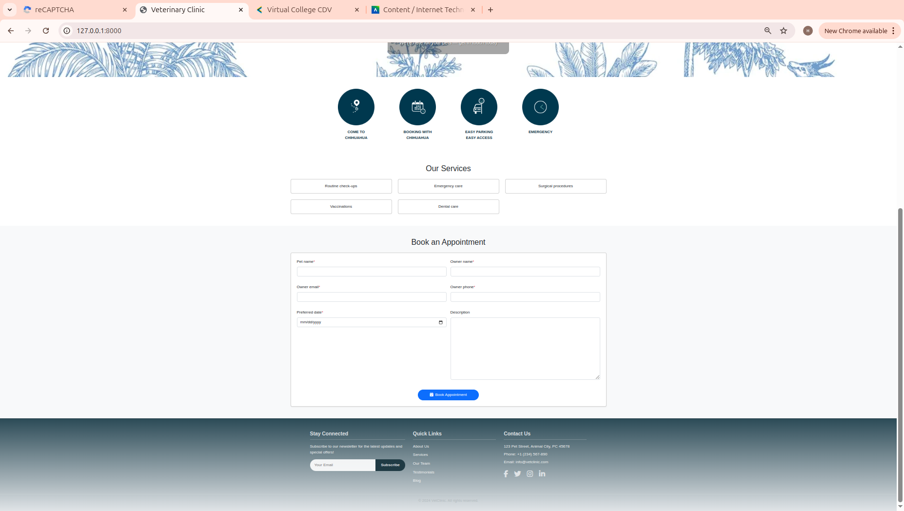
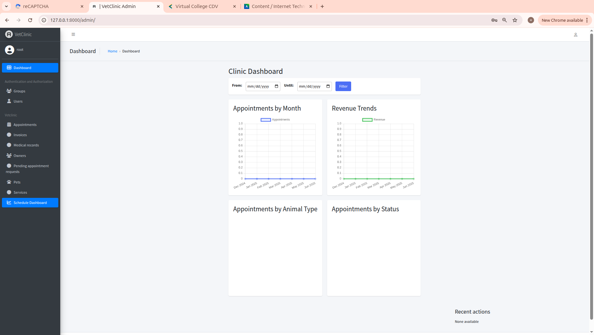
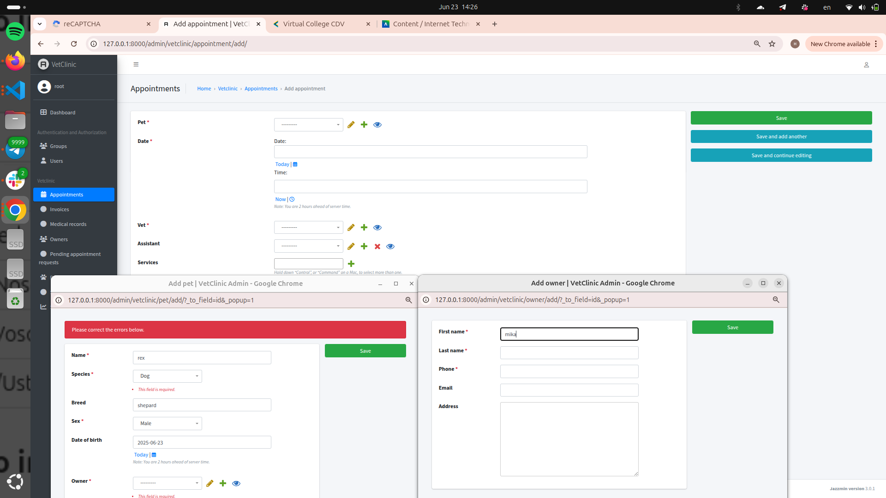
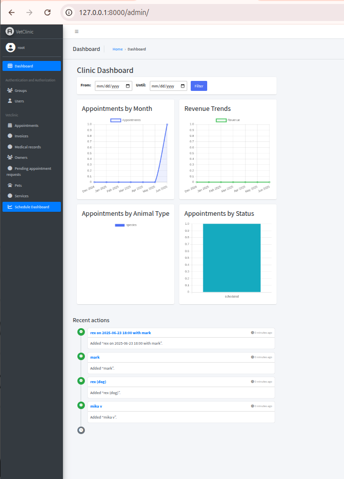
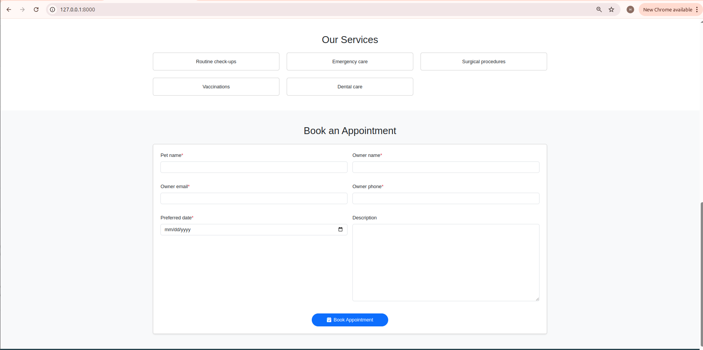
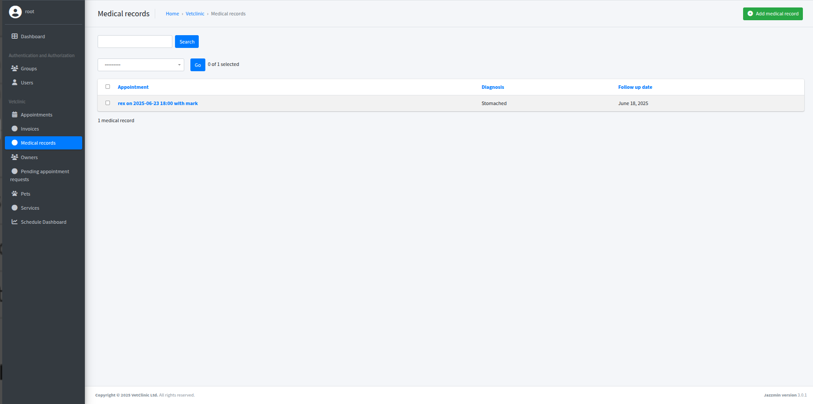
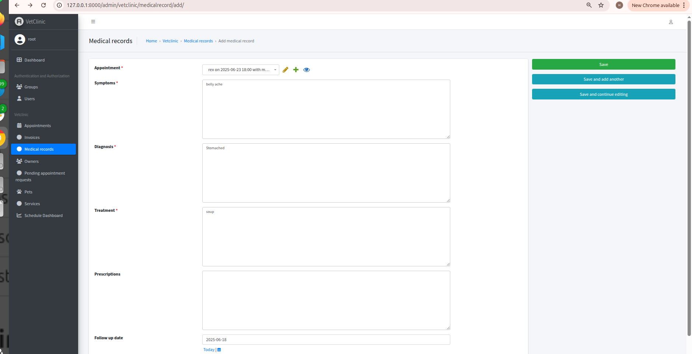

# Veterinary Clinic Management System

## Project Overview

**Veterinary Clinic Management System** is a modern web application designed to automate the workflow of a veterinary clinic.  
The system allows for managing clients, pets, appointments, medical records, services, and invoices.  
This project was developed as part of the **Internet Technologies**, **UX Laboratories**, and **UX Workshops** courses.

---

## Technology Stack

- **Backend:** Django 5, Django ORM
- **Frontend:** HTML, CSS, JavaScript, Django Templates
- **UI:** Jazzmin/Jet Reboot (Django Admin themes)
- **Additional:** Django Simple Captcha, Pillow, Widget Tweaks
- **Dev tools:** Poetry, SQLite

---

## Authors

- Mikalai Voina
- Mikita Tsybulko
- Mark Liashuk

---

## How to Use

1. **Clone the repository:**
   ```bash
   git clone <repo_url>
   cd veterinary-clinic
   ```

2. **Install dependencies:**
   ```bash
   poetry install
   ```

3. **Create a `.env` file in the project root:**
   ```
   SECRET_KEY=your_secret_key
   RECAPTCHA_PUBLIC_KEY=your_recaptcha_site_key
   RECAPTCHA_PRIVATE_KEY=your_recaptcha_secret_key
   ```
   - Generate `SECRET_KEY`:
     ```bash
     poetry run python -c 'from django.core.management.utils import get_random_secret_key; print(get_random_secret_key())'
     ```
   - Get reCAPTCHA keys: [Google reCAPTCHA admin](https://www.google.com/recaptcha/admin/create)

4. **Apply migrations:**
   ```bash
   poetry run python manage.py makemigrations
   poetry run python manage.py migrate
   ```

5. **Collect static files:**
   ```bash
   poetry run python manage.py collectstatic
   ```

6. **Create a superuser:**
   ```bash
   poetry run python manage.py createsuperuser
   ```

7. **Run the server:**
   ```bash
   poetry run python manage.py runserver
   ```

8. **Admin panel:**  
   [http://127.0.0.1:8000/admin/](http://127.0.0.1:8000/admin/)

---

## Screenshots

- Home page 
- Admin panel   
- Appointment booking page 
- Pet medical record page  

---

## References

- [Teacher’s page (mgr inż. Katarzyna Dadek)](https://cdv.blackboard.com/ultra/courses/_2336_1/outline/file/_60950_1)  
  Detailed evaluation criteria for the project can be found in the file provided by the instructor.

---

## Evaluation Criteria Compliance

- HTML, CSS, JavaScript, Django, and third-party libraries/frameworks are used
- Code is well-structured, modular, and readable
- Interactivity and responsive design are implemented, with a modern UI
- The project fulfills the requirements for all three courses: Internet Technologies, UX Laboratories, UX Workshops
- Mockups and prototypes are created in Figma (https://www.figma.com/design/nxLiGQsRLR0kLSIyIWdNZi/Vet-Clinic?node-id=4-3&t=U5GVHWHs0VsnrsXN-0)

---
